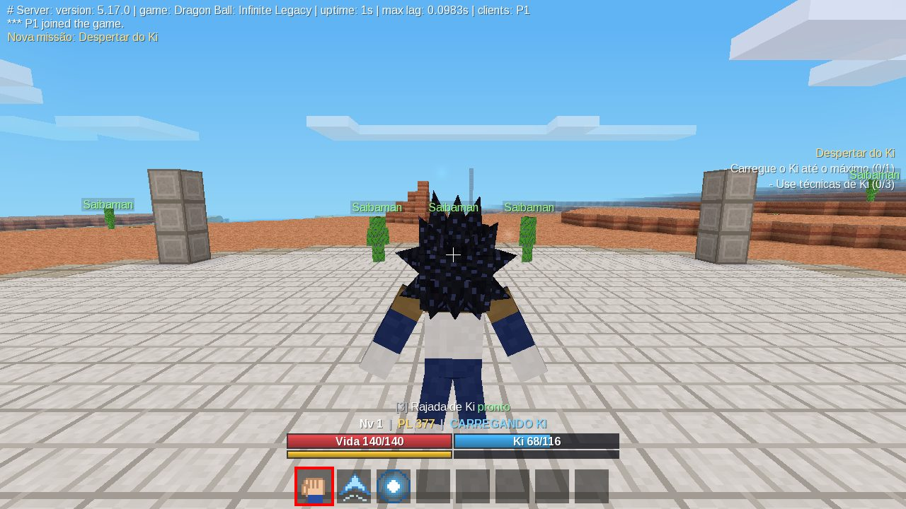

# Dragon Ball: Infinite Legacy

RPG cooperativo de mundo aberto no universo de Dragon Ball, feito como um **jogo para o Luanti** (antigo Minetest), para PC e Android. Projeto pessoal e privado.

Os protagonistas são os personagens criados pelos jogadores. Goku, Vegeta, Piccolo e companhia vão existir como mestres, aliados e inimigos numa linha temporal alternativa — com fendas temporais e cenários "E se...?" no futuro.

> **Estado atual: vertical slice jogável (v0.1.0).** Criar personagem → carregar Ki → voar → lutar → usar técnicas → derrotar Saibamen → evoluir → salvar → continuar depois, em co-op para 2 jogadores. Veja [o que existe e o que falta](docs/ROADMAP.md).



## Instalação

Requer **Luanti 5.9 ou mais recente** (testado com o 5.17.0). Não precisa de nenhum outro jogo ou mod.

### PC (Windows / Linux / macOS)

1. Copie a pasta `dbil/` deste repositório para a pasta `games/` do Luanti, mantendo o nome `dbil`:
   - Windows: `luanti/games/dbil` na versão portátil, ou `%APPDATA%\Luanti\games\dbil` na versão instalada
   - Linux: `~/.minetest/games/dbil` (ou `~/.var/app/org.luanti.luanti/.minetest/games/dbil` no Flatpak)
2. Abra o Luanti → aba **Iniciar jogo** → escolha **Dragon Ball: Infinite Legacy** na barra de jogos.
3. **Novo** mundo (mapgen padrão `v7`), ative **Dano** e jogue.

### Android

1. Instale o Luanti (Play Store / F-Droid).
2. Copie a pasta `dbil/` para a pasta de jogos do app, normalmente
   `Android/data/net.minetest.minetest/files/games/dbil`
   (pelo cabo USB no PC ou por um gerenciador de arquivos com acesso a `Android/data`; o caminho pode variar conforme a versão do app).
3. Abra o Luanti, escolha o jogo e crie o mundo.

### Jogando em dupla

- **Mesma rede (Wi-Fi):** um jogador marca **Hospedar servidor** ao iniciar o mundo; o outro vai em **Entrar em jogo** e digita o IP local de quem hospeda (porta `30000`).
- **Pela internet:** quem hospeda precisa liberar a porta UDP `30000` no roteador (ou usar uma VPN como ZeroTier/Tailscale).
- Os dois usam versões do Luanti 5.9+ (de preferência a mesma).

O primeiro jogador que entra num mundo novo espera ~1 segundo enquanto a arena de treino é gerada.

## Como jogar

Ao entrar pela primeira vez aparece a tela **Crie seu guerreiro**: escolha o nome e a raça (**Humano** ou **Saiyajin**). Você surge numa arena de treino; Saibamen brotam dos canteiros em volta dela e bonecos de treino ficam no palco. A missão tutorial guia os primeiros passos.

| Ação | PC | Celular (toque) |
| --- | --- | --- |
| Mover / câmera | WASD / mouse | joystick / arrastar |
| Pular · subir no voo | Espaço | botão Pulo |
| Agachar · descer no voo | Shift | botão Agachar |
| **Carregar Ki** | segurar **E** (Aux1) parado | segurar **Aux1** parado, ou toque longo com uma técnica na mão |
| **Dash / esquiva** e corrida | **E** + direção | **Aux1** + joystick |
| Voo rápido | **E** + direção voando | **Aux1** + joystick voando |
| **Voar** | item **Voo** (espaço 2) ou pular de novo no ar | item Voo ou pular de novo no ar |
| Pousar | segurar Shift encostando no chão | segurar Agachar no chão |
| **Golpe rápido** (combo) | Punhos (1) + clique esquerdo | Punhos + toque |
| **Golpe pesado** | Punhos + clique direito | Punhos + toque longo |
| **Defesa** | segurar **Z** (Zoom) | segurar botão **Zoom** |
| **Técnica de Ki** | espaço 3-6 + clique (segure para carregar as carregáveis) | selecionar + toque (toque longo para carregar) |
| Transformação | espaço 7 + clique / clique direito volta ao normal | toque / toque longo |
| Ficha do personagem | **I** (inventário) | botão inventário (menu ⋯) |

Hotbar: `1 Punhos · 2 Voo · 3-6 Técnicas equipadas · 7 Transformação (quando desbloqueada) · 8 livre`.

Mais detalhes em [docs/CONTROLES.md](docs/CONTROLES.md).

## Comandos de desenvolvimento

`/dbil help` lista tudo. Exigem o privilégio `dbil_admin` (automático no modo um jogador e para o admin do servidor; para dar ao primo: `/grant <nome> dbil_admin`).

`info`, `pl`, `heal`, `ki <valor|max>`, `hp`, `stamina`, `xp <n>`, `level <n>`, `attr <atributo> <valor>`, `learn <técnica>`, `forget`, `techniques`, `mastery <chave> <nível>`, `unlock <transformação>`, `lock`, `transform <id|off>`, `flag <flag> [on|off]`, `fly`, `god`, `spawn <inimigo> [qtd]`, `killall`, `quest <start|complete|abandon> <id>`, `pvp <on|off>`, `spawnpoint`, `save`, `reset confirmar`, `status`.

Exemplo para testar o Super Saiyajin (experimental) com um Saiyajin: `/dbil level 20`, `/dbil flag ssj_awakened on`, `/dbil unlock super_saiyan` e use o item Transformação.

## Estrutura do repositório

```
dbil/                  o jogo Luanti (copie esta pasta para games/)
  game.conf, minetest.conf, settingtypes.txt, menu/, screenshot.png
  mods/
    dbil_core/         namespace, config central, eventos, scheduler, schemas, persistência, efeitos
    dbil_character/    personagem: dados, raças (registro), sessões, atributos, recursos, Poder de Luta,
                       física em camadas, aparência, animação, atores (jogadores + NPCs)
    dbil_races/        definições de raças (Humano, Saiyajin)
    dbil_input/        controles → intenções → ações validadas; itens do kit da hotbar
    dbil_ki/           API de Ki e carregamento
    dbil_movement/     voo, dash, corrida
    dbil_combat/       pipeline de dano, alvo/lock-on, golpes, defesa, morte e respawn
    dbil_techniques/   framework de técnicas, formas, motor de projéteis, técnicas
    dbil_progression/  XP/níveis, treino, maestria
    dbil_enemies/      NPCs inimigos, IA, geradores (Saibaman, boneco de treino)
    dbil_items/        consumíveis (Senzu), coleta automática
    dbil_transformations/ sistema de transformações (Kaioken, Super Saiyajin experimental)
    dbil_quests/       missões e tutorial
    dbil_world/        terreno, biomas, arena de testes, dimensões e respawn
    dbil_ui/           HUD, notificações, criação de personagem, ficha
    dbil_debug/        comandos /dbil
docs/                  documentação (arquitetura, API, assets, testes, roadmap)
tests/                 testes unitários (LuaJIT) e de integração (servidor + 2 clientes reais)
tools/                 geradores dos assets temporários e scripts de teste
```

## Documentação

- [Arquitetura](docs/ARQUITETURA.md) — módulos, fluxo de dados e como estender (raças, técnicas, inimigos, transformações, missões...)
- [API e eventos](docs/API.md)
- [Controles](docs/CONTROLES.md)
- [Assets temporários](docs/ASSETS.md)
- [Testes](docs/TESTES.md)
- [Estado atual, limitações e próximos passos](docs/ROADMAP.md)

## Configuração

Todos os números de gameplay ficam em `dbil/mods/dbil_core/config/*.lua`. Qualquer valor pode ser sobrescrito no `minetest.conf` do servidor pelo caminho completo, por exemplo:

```
dbil.combat.pvp = true
dbil.flight.drain_moving = 1.5
dbil.progression.max_level = 80
```

Os principais também aparecem em **Configurações → Jogos → Dragon Ball: Infinite Legacy**.
